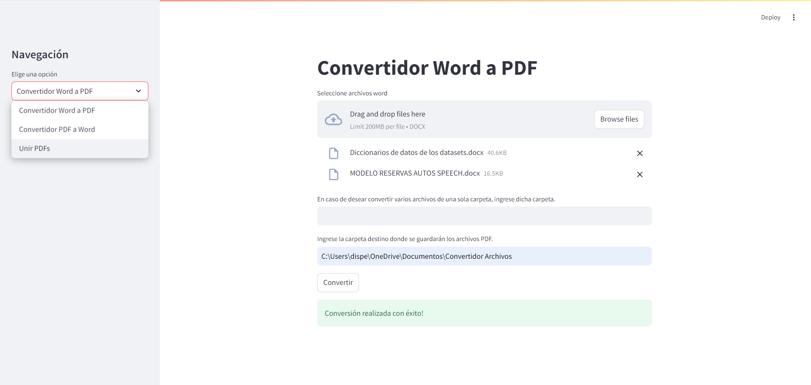
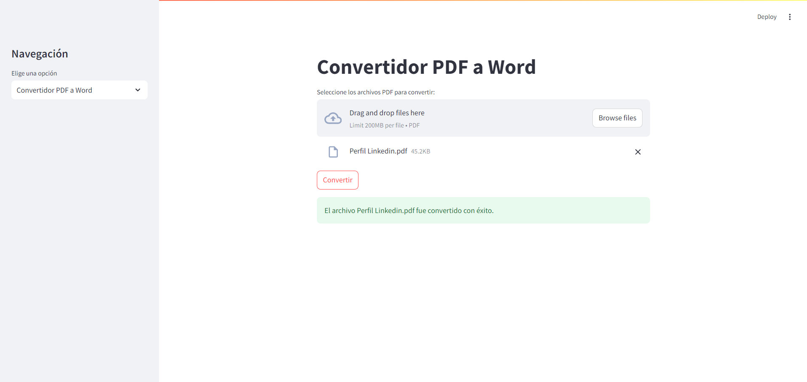
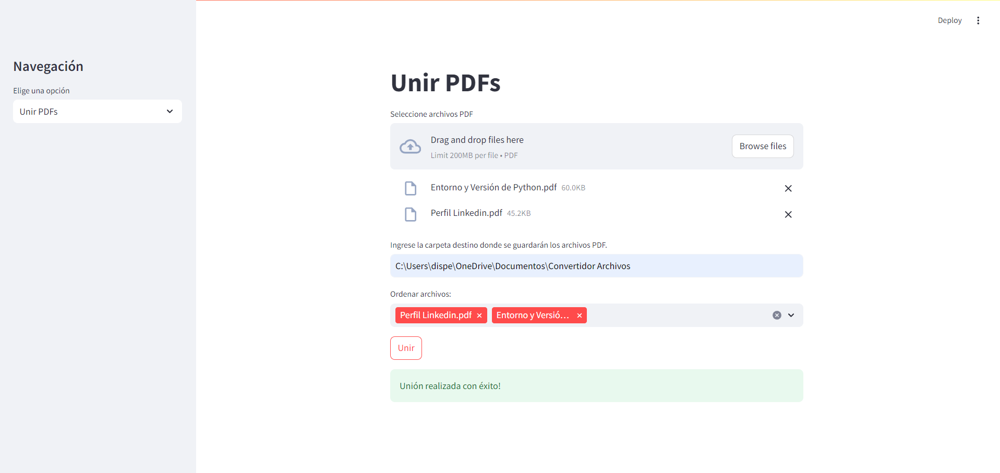

# CONVERTIDOR DE ARCHIVOS

## Descripción
Este proyecto es una aplicación web desarrollada con Streamlit que permite la conversión de archivos:

- **Convertir Word a PDF**
- **Convertir PDF a Word**
- **Unir múltiples archivos PDF en uno solo**

## Funcionalidades 

### Convertir Word a PDF 

- Cargar uno o varios archivos "docx" (ya sea seleccionando individualmente o detallando la carpeta donde se encuentran los archivos).
- Ingresar la carpeta de destino donde se descargarán los nuevos PDFs convertidos.

### Convertir PDF a Word

- Cargar uno o varios archivos ".pdf".
- Los archivos ".docx" se descargarán en la carpeta actual que se encuentran los PDFs.

### Unir múltiples archivos PDF en uno solo

- Cargar varios archivos PDF .
- Ordenar los archivos en la posición deseada, para que una vez unidos, sigan respetando el orden especificado.
- Ingresar la carpeta de destino donde se descargará el nuevo PDF.

## Instalación

Para ejecutar este proyecto localmente, sigue estos pasos: 

1. **Clona el repositorio:**

git clone https://github.com/Facu6/Convertidor-De-Archivos-Word-PDF.git

cd tu-repositorio

2. **Crea un entorno virtual e instálalo**

python -m venv venv

venv\Scripts\activate 

3. **Instala las dependencias**

pip install -r requirements.txt

4. **Ejecuta la aplicación**

streamlit run app.py

## Ejemplo de uso

1. Ejecuta la aplicación y abre el navegador en la dirección proporcionada por Streamlit.
2. Selecciona la opción deseada en el menú lateral:

    - Convertidor Word a PDF
    - Convertidor PDF a Word
    - Unir PDFs

3. Carga los archivos correspondientes y haz clic en "Convertir".

## Estructura del Proyecto

.

├── images

│   ├── PDF_Word.png

│   ├── Union_PDFs.png

│   └── Word_PDF.png

├── app.py

├── requirements.txt

└── README.md

- **images**
    Carpeta con las imagenes del deploy en Streamlit.

- **app.py**
    Este archivo contiene todo el código necesario para interfaz y la lógica de conversión de archivos utilizando Streamlit.

    **Explicación de Funciones**
    
    - generador_nombre_unico(carpeta, nombre_base)

        Genera un nombre único para un archivo PDF en una carpeta específica para evitar sobreescrituras. Si un archivo con el nombre base ya existe, se añade un número al nombre hasta encontrar un nombre disponible.

    - convertidor_archivos(carpeta_origen, carpeta_destino, archivos_docx_individuales=None)

        Convierte archivos .docx a PDF y los guarda en una carpeta de destino. Puede convertir archivos individuales seleccionados por el usuario o todos los archivos .docx en una carpeta específica. Inicializa y desinicializa COM para la conversión.

    - unir_pdfs(lista_archivos_pdf, carpeta_destino_pdf, nombre_base='pdfs_unidos')
      
        Une múltiples archivos PDF en un solo documento y lo guarda en una carpeta de destino con un nombre único. Utiliza PyPDF2 para combinar las páginas de los archivos PDF seleccionados.

    - convertir_pdf_word(pdf, nombre_salida, carpeta_destino_word)

        Convierte un archivo PDF a un documento Word (.docx) y lo guarda con el nombre especificado en una carpeta de destino. Utiliza pdf2docx para realizar la conversión.

    - main()

        La función principal de la aplicación Streamlit. Proporciona una interfaz de usuario para:

        - Convertir archivos Word a PDF.
        - Convertir archivos PDF a Word.
        - Unir múltiples archivos PDF en uno solo. Dependiendo de la opción seleccionada por el usuario, se solicita la           entrada necesaria y se ejecuta la función correspondiente para realizar la tarea.

- **requirements.txt**
    Contiene todas las dependencias necesarias para ejecutar el proyecto.

## Contribución 

Si deseas contribuir a este proyecto, por favor sigue estos pasos:

1. Haz un fork del repositorio.
2. Crea una rama nueva (git checkout -b feature/nueva-funcionalidad).
3. Realiza tus cambios y haz commit (git commit -am 'Agrega nueva funcionalidad').
4. Sube la rama (git push origin feature/nueva-funcionalidad).
Abre un Pull Request.

## Contacto

📫 Puedes encontrarme en:
- [LinkedIn](https://www.linkedin.com/in/facundo-dispenza-2ab560298/) 
- [Email](mailto:dispenzafacu6@gmail.com).
